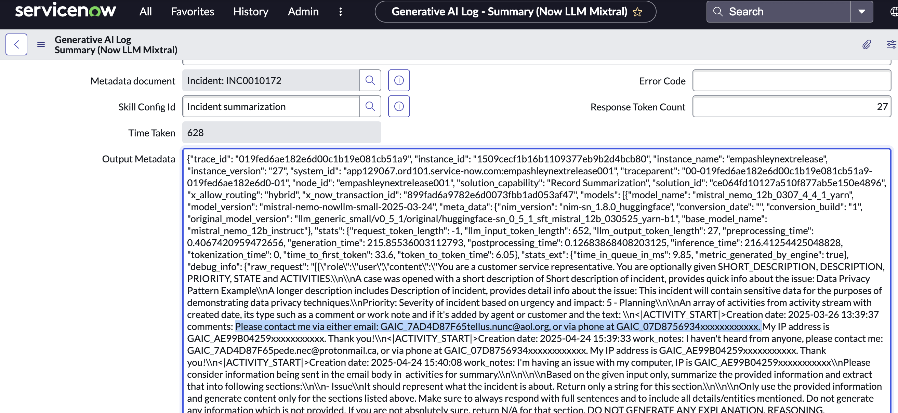
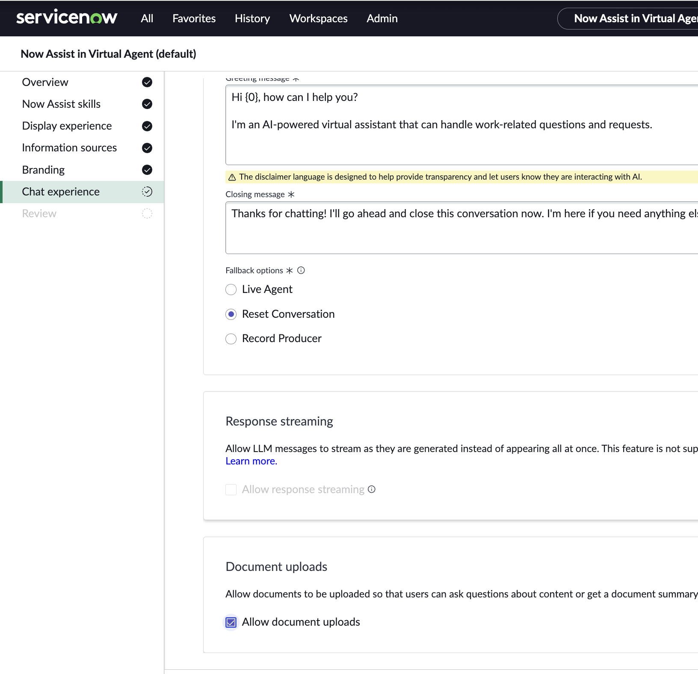

# Section 9: Data Privacy and Security

**Estimated time: 20 minutes**

## Overview

When integrating ServiceNow with external LLMs like OpenAI, data privacy and security become critical considerations. This section covers the essential configurations, monitoring capabilities, and best practices for handling sensitive data in AI-powered workflows.

### Key Security Principles

**Data Minimization:** Only process necessary data
**Encryption:** Protect data in transit and at rest  
**Access Control:** Implement role-based permissions
**Audit Logging:** Track all AI interactions
**Compliance:** Meet regulatory requirements (GDPR, CCPA, etc.)

## Prerequisites

- Administrative access to ServiceNow instance
- Understanding of your organization's data privacy requirements
- Completed previous sections with AI integrations active
- Access to install and configure Data Privacy applications

## Section 9.1: Sensitive Data Handling Configuration

### Understanding Data Flow

When using external LLMs, data flows through several stages:

```
ServiceNow Data → AI Processing → External LLM → Response → ServiceNow Storage
```

Each stage requires specific privacy controls and monitoring.

### Configure Sensitive Data Detection


**Sensitive Data Categories to Monitor:**
- **Personal Identifiers:** SSN, passport numbers, driver's licenses
- **Financial Information:** Credit card numbers, bank accounts
- **Health Information:** Medical record numbers, health conditions
- **Contact Information:** Email addresses, phone numbers, addresses
- **Organizational Data:** Employee IDs, confidential project names

### Set Up Data Masking Rules

Configure automatic data masking for AI processing:

```javascript
// Example: Mask SSN in AI requests
var maskingRule = {
    pattern: /\b\d{3}-\d{2}-\d{4}\b/g,
    replacement: "XXX-XX-XXXX",
    description: "Social Security Number masking"
};

// Example: Mask email addresses
var emailMaskingRule = {
    pattern: /\b[A-Za-z0-9._%+-]+@[A-Za-z0-9.-]+\.[A-Z|a-z]{2,}\b/g,
    replacement: "[EMAIL_REDACTED]",
    description: "Email address masking"
};
```

## Section 9.2: GenAI Logging and Monitoring

### Access GenAI Logs

1. Navigate to **All > sys_generative_ai_log.list**



### Understanding Log Data Structure

The GenAI logs capture comprehensive information about AI interactions:

**Request Information:**
- **Timestamp:** When the request was made
- **User:** Who initiated the AI request
- **Input Data:** What data was sent (may be masked)
- **Prompt:** The actual prompt sent to the LLM
- **Context:** Additional context information

**Response Information:**
- **Output:** AI-generated response
- **Processing Time:** How long the request took
- **Token Usage:** Number of tokens consumed
- **Model Information:** Which AI model was used
- **Confidence Scores:** AI confidence in the response

**Metadata:**
- **Application Scope:** Which app generated the request
- **Integration Point:** Where in ServiceNow the AI was called
- **Error Information:** Any errors or warnings
- **Feedback Data:** User feedback on AI responses

### Log Analysis and Monitoring

**Key Monitoring Points:**

```javascript
// Monitor for sensitive data exposure
var sensitiveDataRegex = [
    /\b\d{3}-\d{2}-\d{4}\b/,  // SSN
    /\b\d{4}\s?\d{4}\s?\d{4}\s?\d{4}\b/,  // Credit Card
    /\b[A-Za-z0-9._%+-]+@[A-Za-z0-9.-]+\.[A-Z|a-z]{2,}\b/  // Email
];

// Alert on potential data exposure
function checkForSensitiveData(logEntry) {
    var inputText = logEntry.input_data;
    var outputText = logEntry.output_data;
    
    sensitiveDataRegex.forEach(function(regex) {
        if (regex.test(inputText) || regex.test(outputText)) {
            generateSecurityAlert(logEntry, 'Potential sensitive data exposure');
        }
    });
}
```

### Automated Monitoring Setup

**Real-time Alerts:**
- Unusual data patterns in AI requests
- High volume of AI API calls from single user
- Failed masking operations
- Potential data leakage patterns

**Daily Reports:**
- AI usage statistics by department
- Token consumption and cost analysis
- Data privacy compliance metrics
- Error rate analysis

## Section 9.3: Required Data Privacy Applications

### Install Data Privacy Framework

Customers must install, review, and configure both Data Privacy applications from the ServiceNow Store:

**Required Applications:**

1. **[Data Privacy](https://store.servicenow.com/sn_appstore_store.do)**
   - Core privacy framework
   - Data classification capabilities
   - Privacy impact assessments
   - Consent management

2. **[Data Discovery](https://store.servicenow.com/sn_appstore_store.do)**
   - Automated sensitive data detection
   - Data mapping and inventory
   - Risk assessment tools
   - Compliance reporting

### Configure Data Classification

**Sensitive Data Categories:**

| **Category** | **Examples** | **AI Processing** | **Masking Required** |
|--------------|--------------|-------------------|---------------------|
| **Public** | Product information, general FAQs | ✅ Allowed | ❌ No |
| **Internal** | Employee directories, internal procedures | ⚠️ Restricted | ✅ Partial |
| **Confidential** | Financial data, strategic plans | ❌ Prohibited | ✅ Full |
| **Highly Confidential** | Personal data, trade secrets | ❌ Prohibited | ✅ Full |

### Privacy Impact Assessment

Before deploying AI features, conduct a Privacy Impact Assessment (PIA):

**Assessment Areas:**
1. **Data Collection:** What data is being processed?
2. **Processing Purpose:** Why is AI processing necessary?
3. **Data Minimization:** Is only necessary data being used?
4. **Retention Period:** How long is data stored?
5. **Third-Party Sharing:** What data goes to external LLMs?
6. **User Rights:** How can users control their data?

## Section 9.4: Compliance and Regulatory Considerations

### GDPR Compliance

**Key Requirements:**
- **Lawful Basis:** Establish legal basis for AI processing
- **Data Subject Rights:** Enable access, correction, deletion
- **Data Protection by Design:** Build privacy into AI systems
- **Impact Assessments:** Conduct DPIAs for high-risk processing

### CCPA Compliance

**California Consumer Privacy Act Requirements:**
- **Transparency:** Disclose AI data processing to users
- **Opt-Out Rights:** Allow users to opt out of AI processing
- **Data Minimization:** Process only necessary personal information
- **Third-Party Disclosure:** Document LLM data sharing

### Industry-Specific Regulations

**Healthcare (HIPAA):**
- Enhanced protection for health information
- Strict audit logging requirements
- Business Associate Agreements with LLM providers

**Financial Services:**
- PCI DSS compliance for payment data
- Enhanced security controls for financial information
- Regular security assessments

**Government:**
- FedRAMP compliance requirements
- Enhanced security controls
- Specific data residency requirements

## Section 9.5: Best Practices for Secure AI Implementation

### Data Preparation

**Before AI Processing:**

```javascript
// Comprehensive data sanitization
function sanitizeForAI(inputData) {
    var sanitized = inputData;
    
    // Remove sensitive patterns
    sanitized = removePII(sanitized);
    sanitized = removeFinancialData(sanitized);
    sanitized = removeHealthInformation(sanitized);
    
    // Apply data minimization
    sanitized = keepOnlyNecessaryData(sanitized);
    
    // Log sanitization actions
    logDataSanitization(inputData, sanitized);
    
    return sanitized;
}
```

### Response Handling

**After AI Processing:**

```javascript
// Secure response processing
function processAIResponse(response, originalContext) {
    // Scan response for unexpected sensitive data
    var scannedResponse = scanForSensitiveData(response);
    
    // Apply organizational data policies
    var filteredResponse = applyDataPolicies(scannedResponse);
    
    // Log response handling
    logResponseProcessing(response, filteredResponse);
    
    return filteredResponse;
}
```

### Access Control Implementation

**Role-Based AI Access:**

```javascript
// Define AI access roles
var aiAccessRoles = {
    'ai_admin': {
        permissions: ['configure', 'monitor', 'audit'],
        description: 'Full AI system administration'
    },
    'ai_user': {
        permissions: ['use', 'view_results'],
        description: 'Standard AI feature usage'
    },
    'ai_auditor': {
        permissions: ['audit', 'view_logs'],
        description: 'AI system auditing and compliance'
    }
};
```

### API Security Configuration

**Secure External Integrations:**

```javascript
// Secure API configuration
var apiSecurityConfig = {
    encryption: 'TLS 1.3',
    authentication: 'API_KEY_ROTATION',
    rateLimit: '1000_requests_per_hour',
    monitoring: 'REAL_TIME_ALERTS',
    dataResidency: 'REGION_SPECIFIC',
    auditLogging: 'COMPREHENSIVE'
};
```

## Section 9.6: Document Q&A Security Considerations

### Document Processing Security

When implementing Document Q&A capabilities:



**Security Controls for Document Processing:**
- **Document Classification:** Classify documents before AI processing
- **Access Controls:** Ensure only authorized users can query documents
- **Content Filtering:** Remove sensitive information before processing
- **Response Validation:** Check AI responses for inappropriate content disclosure

### AI-Generated Content Warnings


**User Education:**
- Display clear warnings about AI-generated content
- Educate users on limitations and potential inaccuracies
- Provide feedback mechanisms for content quality
- Maintain human oversight for critical decisions

### Document Security Best Practices

**Document Lifecycle Security:**
1. **Upload:** Scan and classify documents
2. **Processing:** Apply appropriate security controls
3. **Storage:** Encrypt and access-control processed data
4. **Query:** Validate user permissions before AI access
5. **Response:** Filter and validate AI-generated responses
6. **Retention:** Apply retention policies to processed documents

## Section 9.7: Incident Response for AI Security

### Security Incident Categories

**AI-Specific Security Incidents:**
- **Data Exposure:** Sensitive data leaked through AI responses
- **Prompt Injection:** Malicious prompts attempting to bypass controls
- **Model Abuse:** Excessive or inappropriate AI usage
- **API Compromise:** Unauthorized access to external LLM services

### Incident Response Procedures

**Immediate Response (0-1 hours):**
1. **Isolate:** Temporarily disable affected AI features
2. **Assess:** Determine scope and impact of incident
3. **Contain:** Prevent further data exposure
4. **Notify:** Alert relevant stakeholders and compliance teams

**Investigation Phase (1-24 hours):**
1. **Forensics:** Analyze logs and determine root cause
2. **Impact Assessment:** Quantify affected data and users
3. **Compliance Review:** Determine regulatory notification requirements
4. **Remediation Planning:** Develop fix and prevention strategies

**Recovery Phase (24-72 hours):**
1. **Implement Fixes:** Deploy security improvements
2. **Restore Services:** Safely re-enable AI features
3. **Monitor:** Enhanced monitoring for similar incidents
4. **Document:** Create incident report and lessons learned

## Monitoring Dashboard Configuration

### Key Metrics to Track

**Security Metrics:**
- Number of sensitive data detection events
- Data masking success/failure rates
- Unauthorized access attempts
- API security events

**Privacy Metrics:**
- User consent status
- Data retention compliance
- Subject access request processing
- Privacy policy adherence

**Operational Metrics:**
- AI feature usage by department
- Cost per AI interaction
- Performance and availability
- User satisfaction scores

### Automated Alerting

**Critical Alerts (Immediate Response):**
- Potential data breach detected
- Multiple failed authentication attempts
- Unusual API usage patterns
- System security compromise indicators

**Warning Alerts (Review Within 4 Hours):**
- Data masking failures
- Performance degradation
- Compliance metric deviations
- User feedback indicating issues

## 🎉 Data Privacy and Security Implementation Complete!

You have successfully:

- ✅ **Configured sensitive data handling** with automatic detection and masking
- ✅ **Set up comprehensive logging** for all AI interactions
- ✅ **Implemented required privacy applications** for compliance
- ✅ **Established security monitoring** and alerting systems
- ✅ **Applied best practices** for secure AI implementation
- ✅ **Created incident response procedures** for AI security events

### Key Security Controls Implemented

🔒 **Data Protection:** Automatic sensitive data detection and masking
📊 **Comprehensive Logging:** Full audit trail of all AI interactions
🛡️ **Access Controls:** Role-based permissions for AI features
⚠️ **Real-time Monitoring:** Automated alerts for security events
📋 **Compliance Framework:** GDPR, CCPA, and industry-specific controls
🚨 **Incident Response:** Structured procedures for security events

### Compliance Checklist

**Data Privacy Compliance:**
- [ ] Privacy Impact Assessment completed
- [ ] Data classification implemented
- [ ] User consent mechanisms configured
- [ ] Data retention policies defined
- [ ] Subject access request procedures established

**Security Compliance:**
- [ ] API security controls configured
- [ ] Encryption for data in transit and at rest
- [ ] Access controls and authentication
- [ ] Monitoring and alerting systems
- [ ] Incident response procedures documented

**Regulatory Compliance:**
- [ ] GDPR requirements addressed
- [ ] CCPA compliance implemented
- [ ] Industry-specific regulations considered
- [ ] Regular compliance audits scheduled
- [ ] Documentation and training materials prepared

---

**Next Section:** [Section 10 - nowassist-for-DocIntel-Doc-Extraction](section10-nowassist-for-DocIntel-Doc-Extraction.md)
**Previous Section:** [Section 8 - Virtual Agent Designer](section8-virtual-agent-designer.md)
**Back to:** [Main README](README.md)
