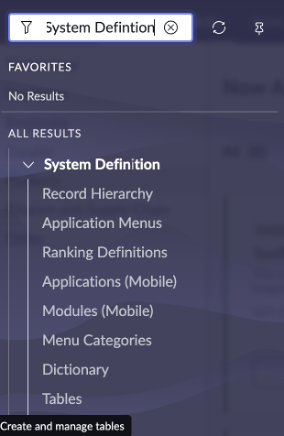
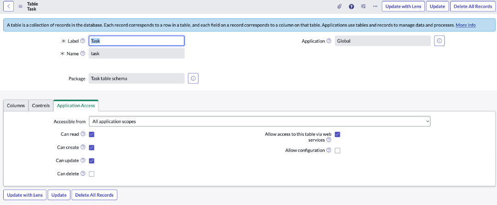
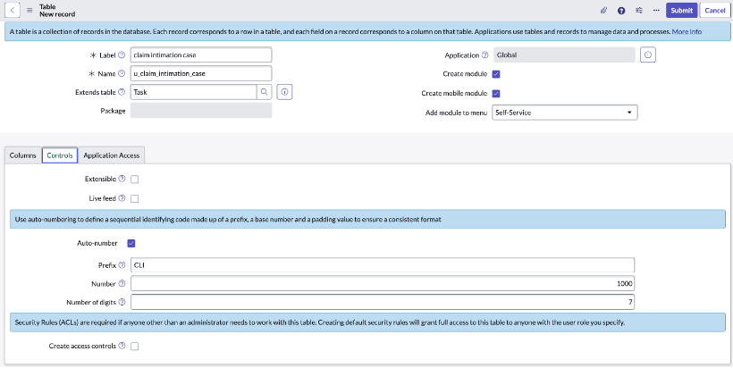
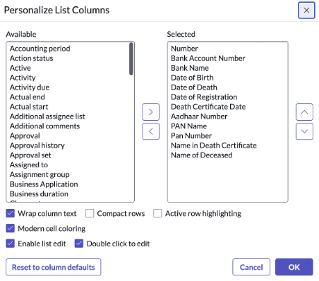
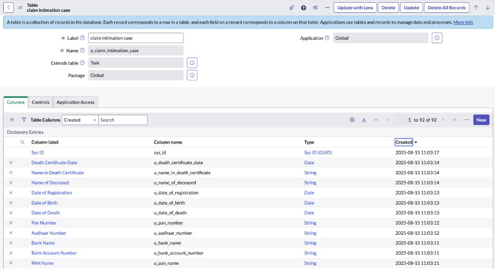
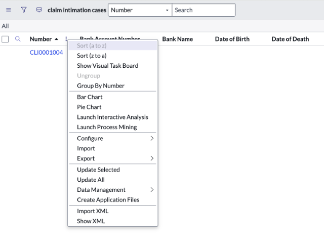
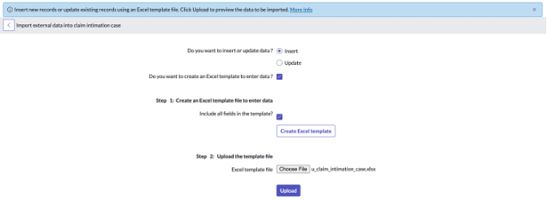

## Section 10 : Pre-requisite before we move on to the Now Assist for Document Intelligence

**Estimated time: 10 minutes**

### In this section of lab, we will building with the following:
1. Creation of custom table (extension of task table)
2. Importing records to custom table & attaching pdf

**Note**: For everything that we will be building today, the application scope is Global.

### Step 1: Go to All > System Definition > Tables

- Create a new table by clicking “New” (top right corner)
- Provide the Label, claim intimation case, with this the Name will get auto-populated
- Extend table to task (not customer service task table), next, we add this to self-service section by add module to Menu (self-serve)

  
- Validate by clicking the information button next to extends table [i], it should be the below extended table

- Next, Click on the Application Access tab
  Check the following
  - Can read
  - Can create
  - Can update
  For rest of the options keep this same.

- Next in Controls > Check Auto-number – provide a pre-fix
  - Add a Number, Let’s say 1000 and number of digit 7
  - This will enable auto-numeric records for the table, similar to Incident table where it starts with INC

- Press the Submit button
  We will now go to the table: u_claim_intimation_case
- In your instance, go to All and type  u_claim_intimation_case.LIST. You will see as below

- Next, Let’s open this table and add the columns we created in the previous step to the selected List

 

- Next, we upload a excel of records, use this excel link

- On the table, click on 3 dots of any column and click Import

- Choose the excel template (link above) and click upload.

- Click preview imported data

- Validate any record to check if the values are imported and next scroll to the bottom and click complete import.

- with this we now have imported a few more dummy records in the table and the table should look something like below.

- Click any one record (ex. CLI0001003)

- Press the attachment icon and attach all the files (File Folder Link). Ensure all files are attached. We will map the fields of the document in Now Assist.

 

- With this, we now have one sample claim submitted and available for validation.

**Next Step:** [Section 11 - Now Assist for Document Intelligence](section11-nowassist-for-document-intelligence.md)
**Previous:** [Section 9 - Data Privacy](section9-data-privacy-security.md)
**Back to:** [Main README](README.md)