## Section 13: Building XCC Connector for Sharepoint

As part of this section we will give details on how to connect to sharepoint online using ServiceNow XCC Connector.

**What are XCC - External Content Connector?**
External content connectors are AI Search plug-ins which enable the crawling, indexing, and searching of external enterprise repositories in a secure manner.  
XCC replace the legacy Raytion enterprise search connectors.  

**What benefits do we receive from XCCs?**

XCC will provide the following benefits for admins and users: 

- Simple Deployment 
XCCs require 2-3 inputs to establish a connection, and creation of a schedule to crawl the content. This drastically reduces the effort from our previous connectors which required 50+ steps and weeks to complete. 
  
- Better Performance 
Ability to conduct partial crawling, Crawling only specified branches of a source system hierarchy, useful for more frequently used directories. Additionally, these connectors are more performant by measure of documents traversed per second. 
  
- Increased Filtering 
More control to the customer to selectively filter which content they want included, such as file type extension filtering, document size filtering, and various directory filtering methods. 
  
- More Flexibility 
Create multiple connectors per source system, which was a prior restriction of ServiceNow’s connectors. Allowing large organizations, with multiple instances, to sync content across all instances of their application.   

 **Product Documentation**
 https://www.servicenow.com/docs/bundle/yokohama-platform-administration/page/administer/ai-search/concept/cfg-ms-spo-ext-content-indexing.html

 As a pre-requisite in a PoV, we need to first **install Store Application**

Go to All > Application Manager > Search - "**External Content Connector Sharepoint Online**"


Install Store Application External Content Connector Sharepoint Online


Once we have installed the XCC Store Application, 

**Here we have two sections to move forward, one where we leverage the demohub XCC setup and we will also cover setup from scratch**


### Let's Get Started with Section 1

**Section 1: XCC setup from scratch**

To configure access, we need to have access certificate.

If you're on Mac, Open Terminal and type: java -version

Most likely you will see an error: **Unable to locate Java Runtime**


Next, we need to go to Oracle website to download Java SE 22
https://www.oracle.com/java/technologies/javase/jdk22-archive-downloads.html


To install JDK, we need Temporary Admin access, Go to Self-Serve on your laptop, Run **Grant Temporary Admin Rights 2 Hours**
Once it successfully runs, you get local admin access.

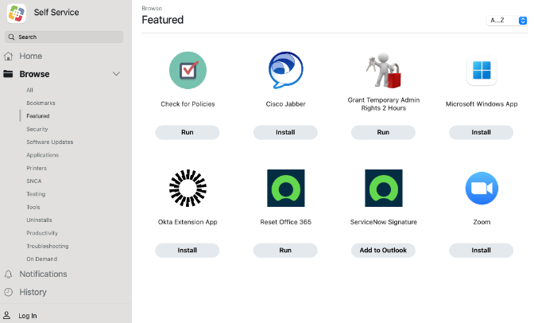

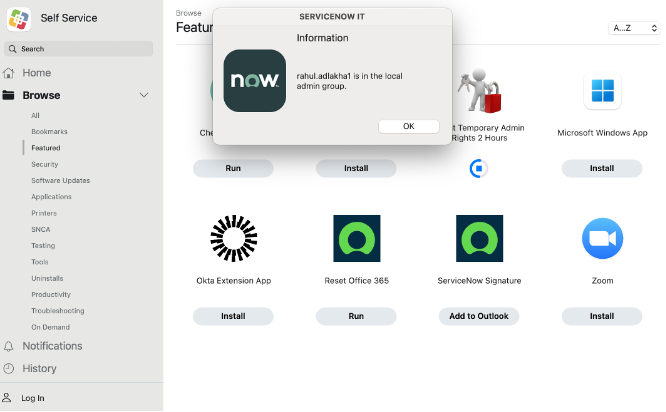

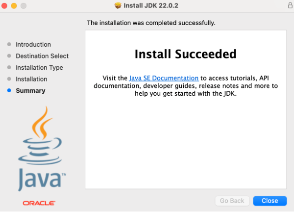

Next, we **generate the certificate.**

Go to Terminal and enter the below command

cd ~/Documents

`keytool -genkey -alias spo-connector-cert -keyalg RSA -keystore spo-connector-cert.jks -storepass "P@ssw0rd\!" -validity 360 -keysize 2048`

With this we need to provide the following information and location to generate the key

```
What is your first and last name?
  [Unknown]:  servicenow.sharepoint.com
What is the name of your organizational unit?
  [Unknown]:  Sales
What is the name of your organization?
  [Unknown]:  ServiceNow
What is the name of your City or Locality?
  [Unknown]:  Bangalore
What is the name of your State or Province?
  [Unknown]:  Karnataka
What is the two-letter country code for this unit?
  [Unknown]:  IN
Is CN=servicenow.sharepoint.com, OU=Sales, O=ServiceNow, L=Bangalore, ST=Karnataka, C=IN correct?
  [no]:  yes
```

With this we get a .jks file

Next, we will generate a .cer file

`keytool -export -alias spo-connector-cert -file spo-connector-cert.cer -keystore spo-connector-cert.jks -storepass "P@ssw0rd\!`

Before we move forwards, let's summarize and make sure we all have:
- Downloaded Store Application
- Installed Java SE 22

Now we will go to Microsoft Azure and have a app registered.
Let's start!


In Microsoft Azure, Search App Registration


Click New Registration

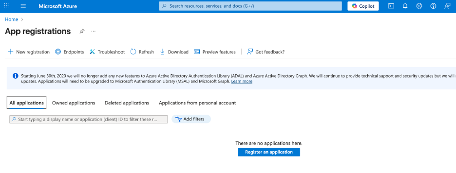

Provide a name and click Register
Example Name: SP Online XCC

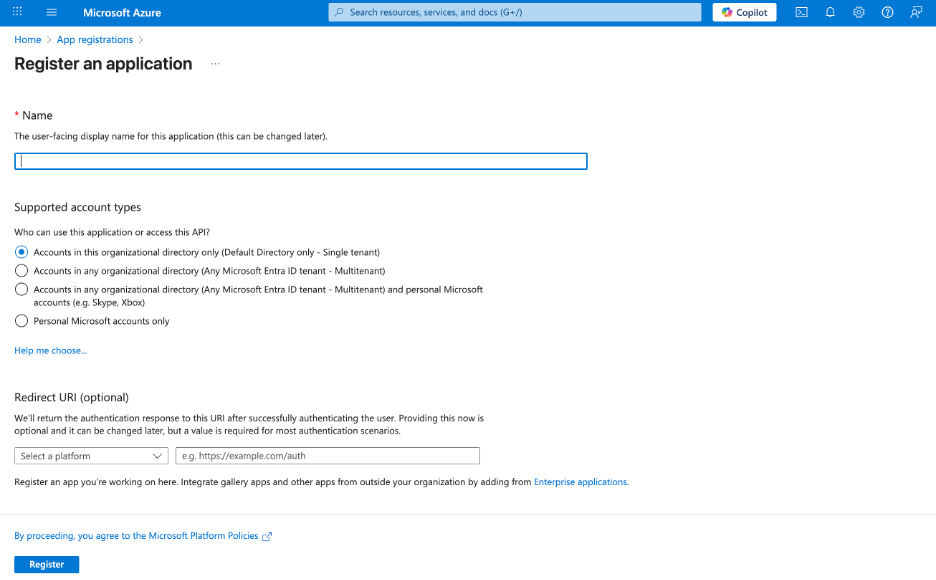

With this we copy Application ID, Directory ID

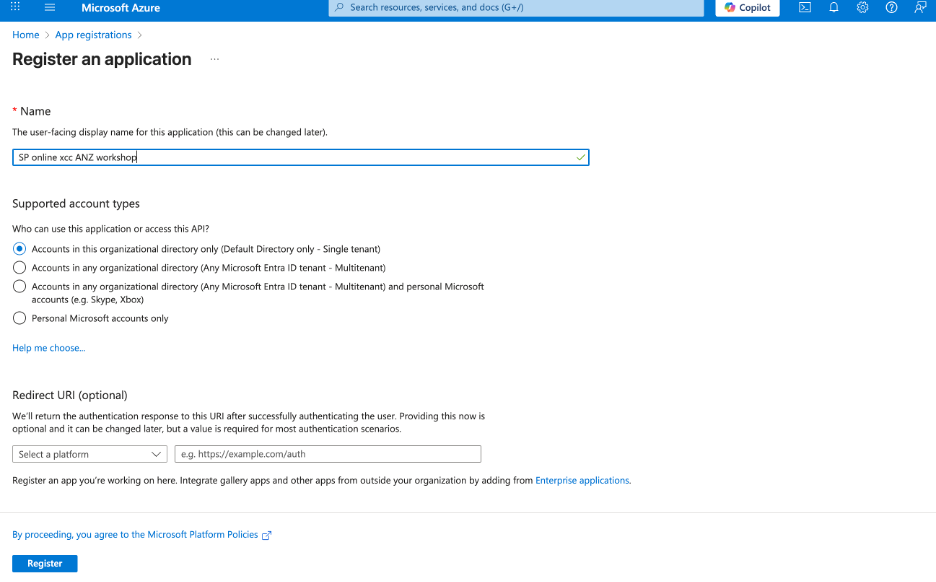


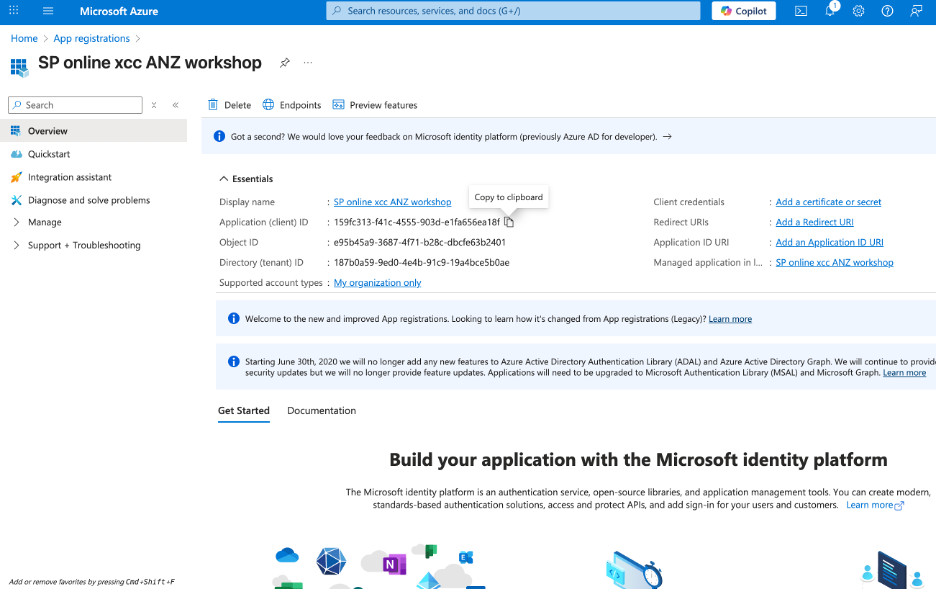

AppId / ClientId: 159fc313-f41c-4555-903d-e1fa656ea18f
ObjectId: e95b45a9-3687-4f71-b28c-dbcfe63b2401
TenantId: 187b0a59-9ed0-4e4b-91c9-19a4bce5b0ae

Next we go to Manage (from the left Pane) and go to **App Registration**

Now we add new API permission, for **Microsoft Graph**

Select Application Permissions
Search for **Group.Read.All**
and Add permission

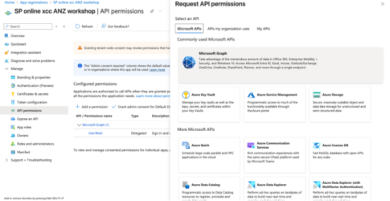
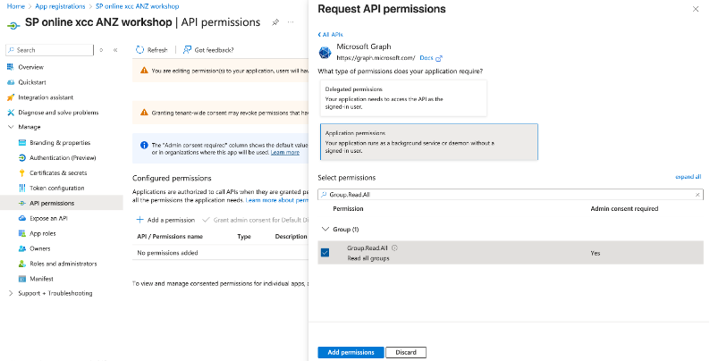


Similarly, we now add two more Application Permissions under Microsoft Graph

**User.Read.All**
**Sites.Read.All**

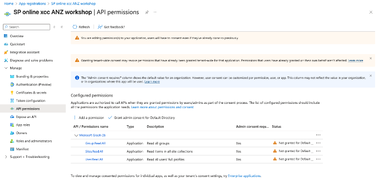

Next, we add another critical permission for **Site Full Control**
**Sites.FullControl.All**

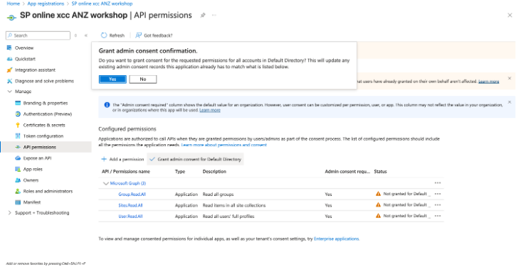

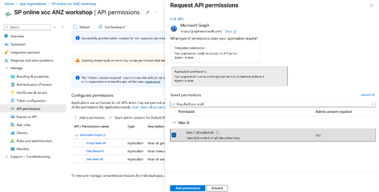


Next, part is granting **Admin Consent**


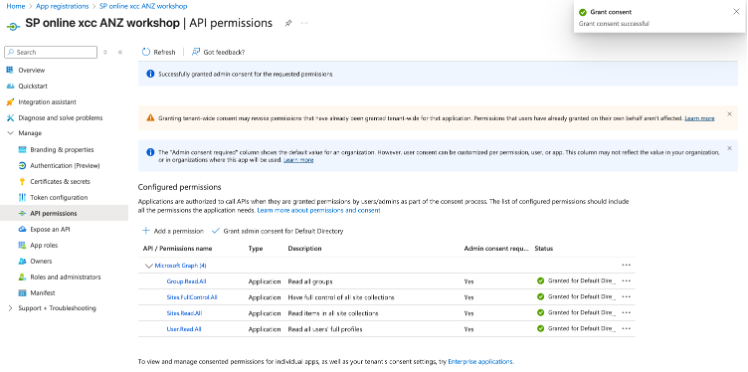

Next, we Go to Certificates & secrets

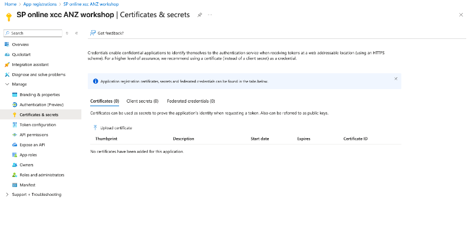

We upload Certificate, .cer file supported


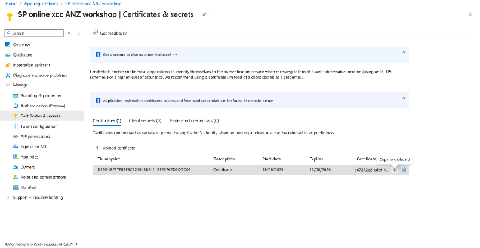

With this now we have a Thumbprint and a certificate value

Thumbprint: D19D1BF57FBEF8C121943B9411BF23767D3DDC03
Certificate: b67212e2-cdc9-4d4a-8164-215269e5b366

**Next we convert HEX Thumbprint to Base64, you can go online and search for HEX to Base64 converter**

Base64 of the Hex: 0Z0b9X+++MEhlDuUEb8jdn093AM=

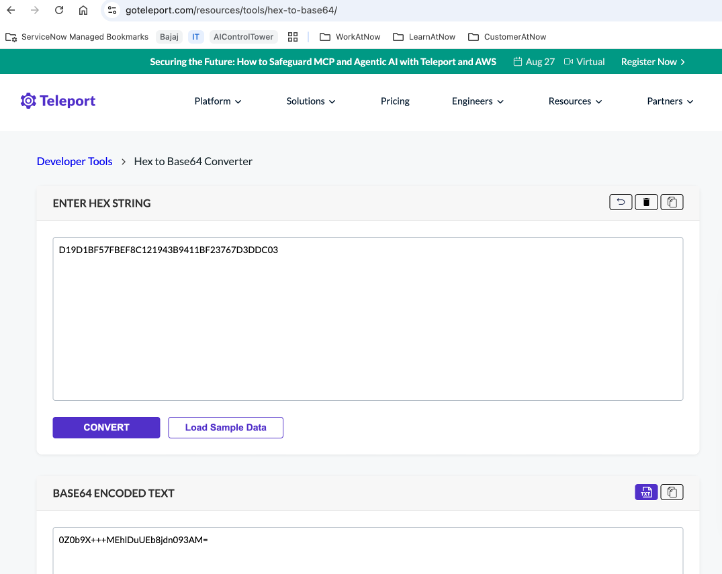

To summarize, we have

1. created a certificate
2. registered an app for sharepoint (generated the ClientID and TenantID)
3. converted Thumbprint HEX to Base64

Superb! We now have completed the all pre-requisites, which we will use as part of integration with Sharepoint

Open your instance (most likely a PoV instance)
Go to All and Search External Content and Click **External Content Admin Home**

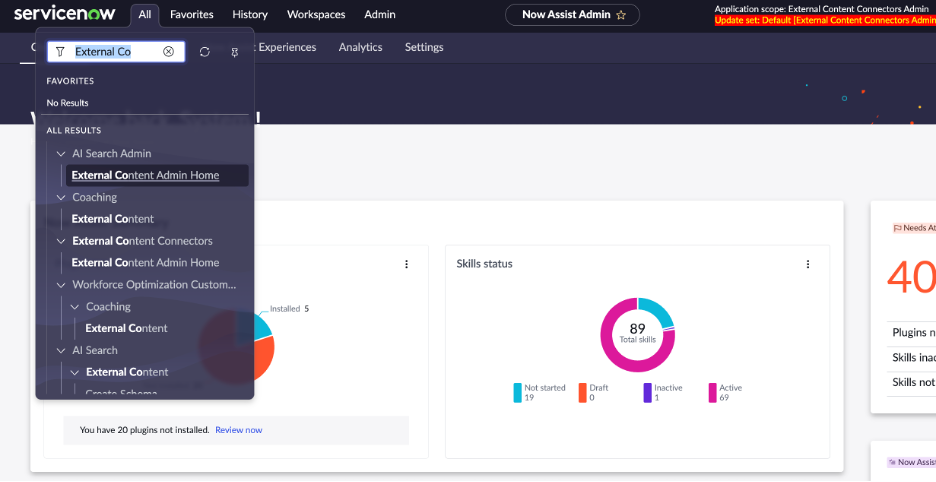

Next we switch the scope

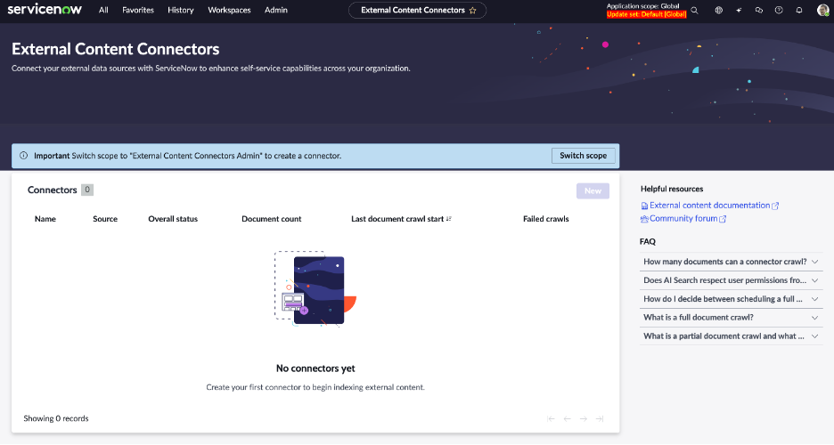

Click New and Choose the Source as sharepoint

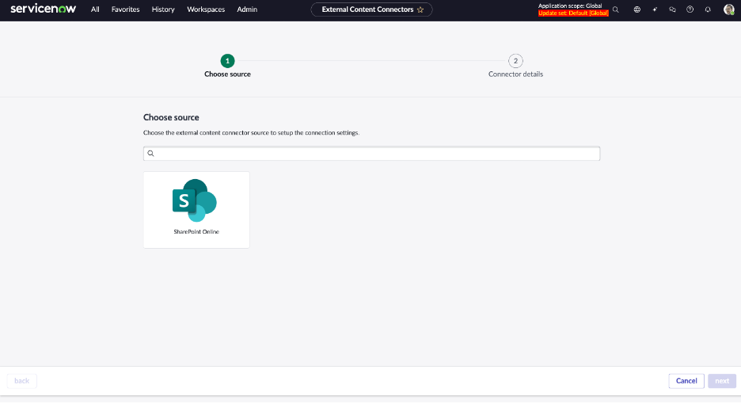

With this we now configure the source

Provide Connection Name: **Sharepoint Online**
Application ID: **Generated in Microsoft App Registration**
Directory (tenant) ID: **Generated in Microsoft App Registration**
JKS Certificate: **Same Certificate generated using terminal**


JKS Certificate Password: **P@ssw0rd!** (Same password used to create the certificates)
JKS Certificate Thumbprint Base64: 0Z0b9X+++MEhlDuUEb8jdn093AM= (HEX to base64 conversion from previous steps)


Amazing! We now have a connection establised!

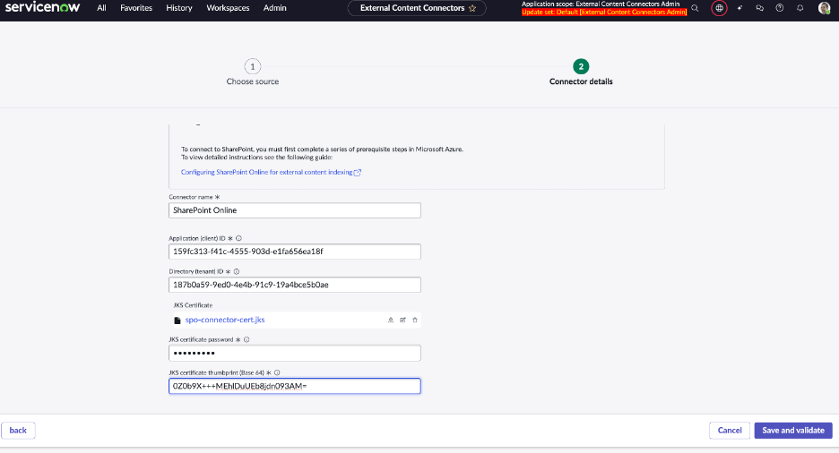

Perfect! We are good.


