# Section 3: Create a Knowledge Graph

**Estimated time: 20 minutes**

##Overview

In this section, we will setup a knowledge graph from scratch, build out the relationships, and then run queries using the 'Test' option as well as AI Agent. 

## Prerequisites

Before starting this section, please ensure that you have:

- Yokohama Patch 5 setup
- There are certain system parameters that need to be setup. In case you run into problems, see the [Enhancing VA with Knowledge Graph](https://www.servicenow.com/community/now-assist-articles/knowledge-graph-enhancing-virtual-agent-search/ta-p/3289078)

## Step 1: Create Knowledge Graph

If your instance has knowledge graph enabled, you would be able to access it as follows:

Type `Knowledge Graph` in filter. 

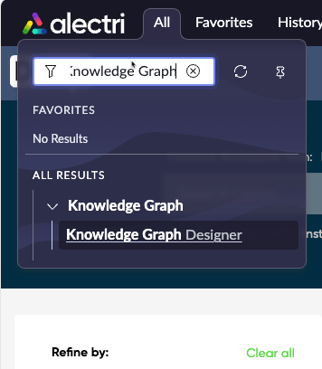

1. Knowledge Graph Designer window will open up. Click `Create New`.


2. Next, let's fill in the following information for our Knowledge Graph. 

- Display Name: `KG for Incidents`
- Name: This will be auto generated as `kg_for_incidents`. (It can be changed).
- Description: `This is a knowledge graph for incident analysis`

3. Click Create.


4. In the next screen, you will be prompted to add nodes (tables) to the knowledge graph. Add the following to the graph. These would be the tables that we would be building our knowledge graph on. 
`User (sys_user)`,
`Incident (incident)`,
`Problem (problem)`,
`Change Request (change_request)`

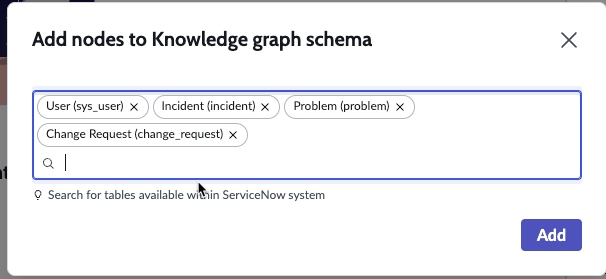

5. The tables that we have added will show up on our canvas, but they are currently not connected, and no relationships have currently been established. 

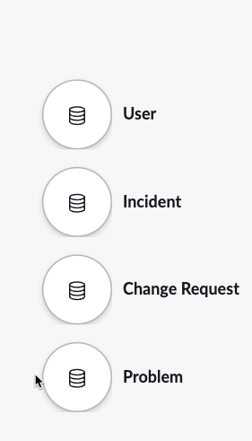

6. Select the `User` table. Then from the side panel (on the right), expand the **Columns that can be queried** under **Node Details**.

7. From the list, select the following columns. These would be the columns that can be queried from this table within the knowledge graph. 

- `city`,
- `email`,
- `employee_number`,
- `first_name`,
- `last_name`,
- `name`,
- `user_name`


8. After selecting column, expand the **Related Nodes** section. This section highlights which predefined relationships can be directly leveraged from the table that we have in the canvas. In this case, there is a self-join on this table, to create a **Manager** relationship. Let's add that to our node. Click the `Manager` option from **Available Nodes**. 

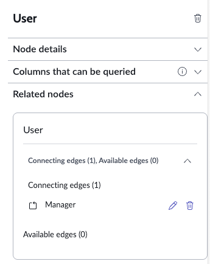

It will look like this:

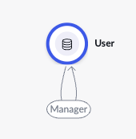

9. Next, we will choose columns to be queried from the `Incident` table. Select the following columns:
- `short_description`,
- `description`,
- `active`,
- `number`,
- `state`

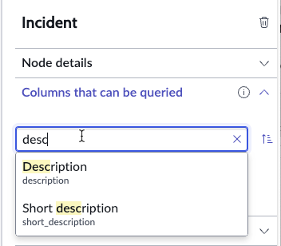

10. Now we will select the available nodes in this table. This table is connected to the `User` table on the following edges. Click on the following in the **Available Edges** list. They will then move to the **Connecting Edges**.

- `Closed by`,
- `Assigned to`,
- `Opened by`

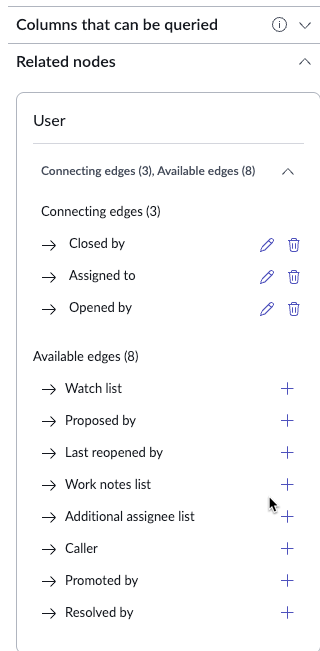

On the canvas, this will be displayed through a direct link between `Incident` and the `User` tables. The number in the middle shows the number of **connected edges** that are available. (In this case, there are 3).

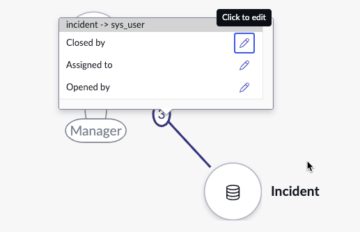

11. Click the `Incident` table again, and open the side panel that shows **Related Nodes**. Under the `Change Request` table, add the `Caused by Change` and `Change Request` edge. 

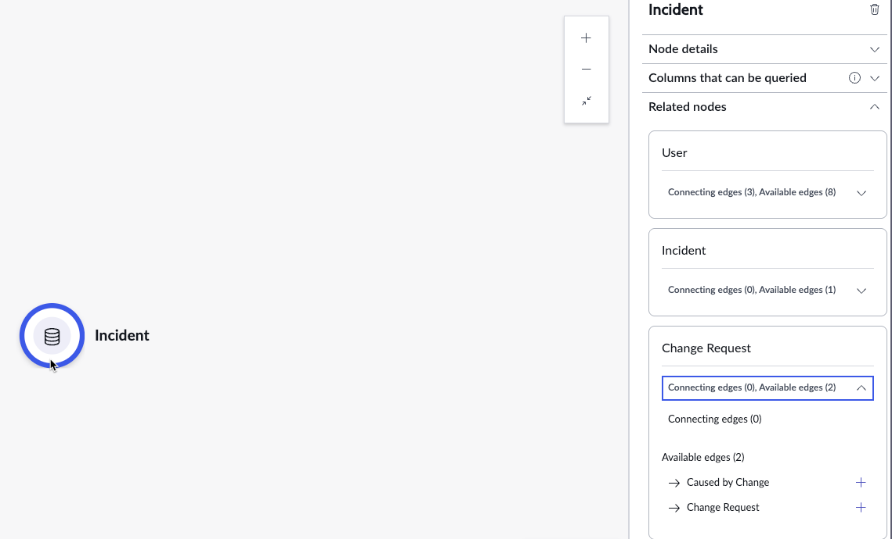

12. Let's connect the last table `Problem` to `Incidents` as well. In the `Incidents` side panel, open the **Related Nodes** again and select `Problem` under **Available edges**. 

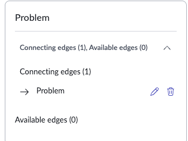

Now all our table are connected. 

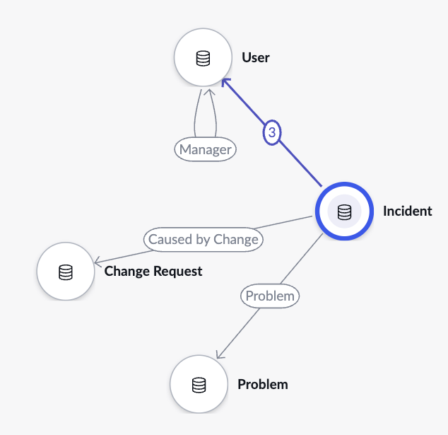

> **Note** Currently we haven't selected any columns from the `Problem` and `Change Request` table. We need to select atleast one column from each, otherwise you will get an error, when you try to save the graph. 

13. Let's select the column `description` from the table `Problem` and the columns `reason` and `short description` from the `Change Request` table, under the category **Columns that can be queried**. 

14. Click **Save** and we have now created our first Knowledge Graph. 

## Step 2: Test Knowledge Graph

1. Click the **Test** button, to write queries and test that the knowledge graph is able to resolve them. 

2. The first query that we will test is: 

```
Which city does Alex Scollan` live in?
```

> If you are using a different table or a different user, ensure that you have checked the `sys_user` table, for a valid record. 


3. Let's test another query: 

```
Who is the manager of Alex Scollan?
```


4. Let's write a slightly more complex query now, as follows:

```
Which incident numbers are assigned to Ravi Kapoor?
```


This completes our section of building and testing the Knowledge Graph. 

## Step 3: Adding Knowledge Graph Query to an AI Agent

Now let's add this Knowledge Graph into an **AI Agent** to invoke this, as part of an **Agentic Workflow**.

1. Let's start by accessing **AI Agent Studio**.

2. Click **New** in the **AI Agent** section. 

3. Let's create a new ai agent with the following properties:

**Name**:`KG Incident Query Agent`

**Description**:

```
This agent helps users find incidents assigned to a particular user by querying the knowledge graph. It is intended for ServiceNow administrators, support staff, or anyone needing quick access to incident assignment information.
```

**Ai Agent Role**:

```
The Incident Query Agent serves as an intelligent assistant that interacts with users to identify and retrieve incidents assigned to specific individuals. It communicates in a clear and professional manner, first gathering the necessary user information and then leveraging the knowledge graph to provide accurate and timely incident lists. The agent is designed to facilitate efficient incident management by streamlining the process of querying and reporting assignments.
```

**Instruction**:

```
You are an expert in querying ServiceNow knowledge graph for incident data.
1. Always ask the name of the user for whom the list needs to be created. Do not proceed if no user name is available. This is an input that will be provided by the user to you, if it is missing.
2. Once the user name has been provided then move to the next step. 
3. Query the knowledge graph for incidents assigned to the specified user.
4. Present a clear and organized list of incidents for the user.
5. Ensure responses are accurate, concise, and easy to understand.
```


4. Click **Save and continue**

5. From the **Add tool** menu, select **Knowledge Graph**.


6. In the **Edit Knowledge Graph** section, provide the following inputs:
- **Name**: `Query the Knowledge Graph`
- **Description**: `This knowledge graph queries the incidents assigned to a given users`
- **Select Knowledge Graph**: `KG for Incidents` (This is the Knowledge Graph we created in the earlier step. 
- **Query Instruction**: `Which incident numbers are assigned to this user?`
- **Execution Mode**: Autonomous
- **Display Output**: Yes
- **Processing Message**: `'Searching the Knowledge Graph'`
- **Output transformation strategy**: 'Paraphrase`

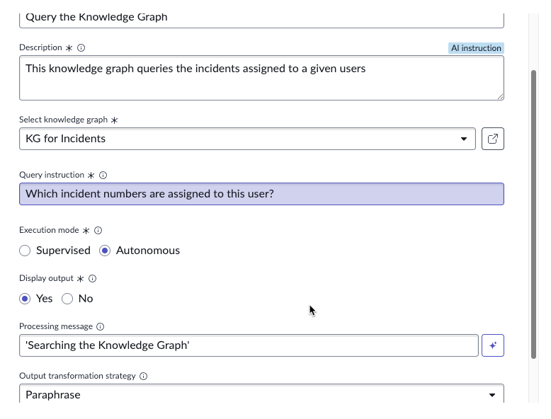

7. Click **Save**.
8. We will not be adding any other tool for now. Click **Save and continue**. 
9. We will not be adding any triggers. Click **Save and continue**. 
10. Enable **Now Assist Panel**. 
11. (Optional). Add the following in **Create a processing message**: `'Initiating Knowledge Graph Agent'`
12. Click **Save and test**.


13. Select **Ai Agent** under **What to test**. 
14. Provide the name of the agent. `KG Incident Query Agent`
15. Click **Start Test**.

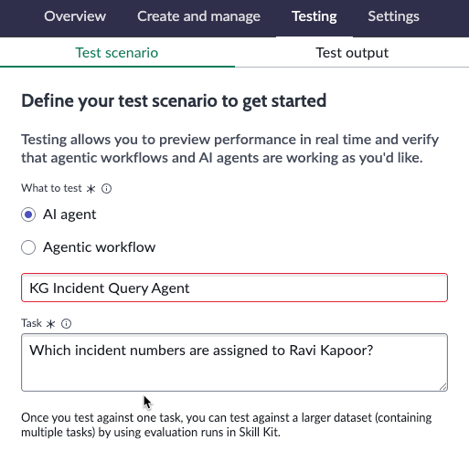

16. You will get the Incident Numbers that are assigned to this user. 

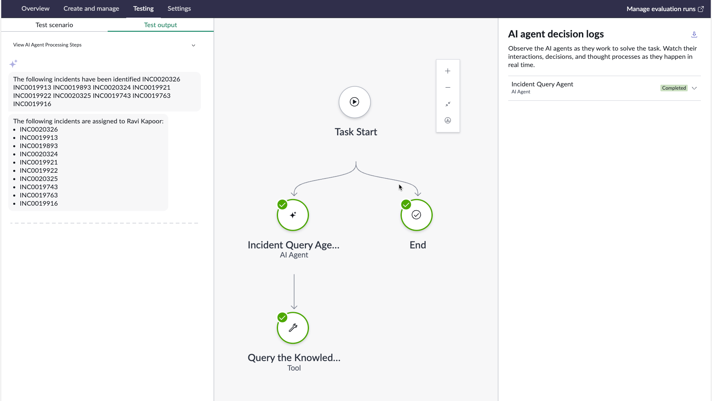

17. This completes our AI Agent with Knowledge Graph section.

>Extra Credit: Additional capability to try out. Optional. 

**Next Section:** [Section 4 - Build Skill Kit with Tools](section4-skill-kit.md)
**Previous Section:** [Section 2 - Building AI Agents](section2-building-agents-simple.md)
**Back to:** [Main README](README.md)


